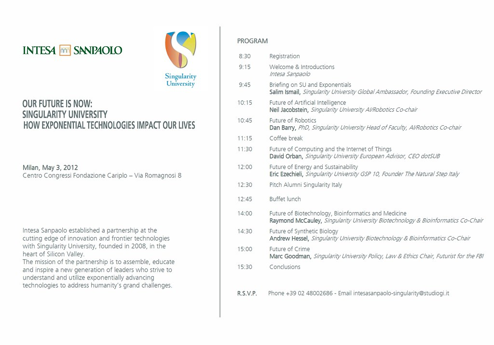

# KI in der Software-Entwicklung

Die neue Realität für Entwickler

---

## Warum dieses Thema?

KI dominiert aktuell die Software-Branche

<!-- .element: class="fragment" -->

Unsicherheit bei vielen Entwicklern und Studierenden

<!-- .element: class="fragment" -->

**Zentrale Frage:** Lohnt sich eine Ausbildung noch?

<!-- .element: class="fragment" -->

Note: Spoiler: Ja, aber die Rolle verändert sich fundamental.

---

## Agenda

- Was ist KI überhaupt?
- Techniken und Werkzeuge
- Auswirkungen auf Software-Entwicklung
- Die Zukunft der Entwickler-Rolle

---

<!-- .slide: data-background-color="#8b7ad6" -->

# Was ist KI?

Grundlagen verstehen

--

## KI ist kein neues Phänomen

**Artificial Intelligence** existiert seit den 1950er Jahren

<!-- .element: class="fragment" -->

**Aber:** Durchbruch in den letzten Jahren durch:

<!-- .element: class="fragment" -->

- Massive Rechenleistung
- Große Datenmengen
- Neue Algorithmen (Deep Learning, Transformer)

<!-- .element: class="fragment" -->

 <!-- .element: style="max-height: 400px;" -->

<small>Quelle: A Health Blog, CC BY-SA 2.0</small>

--

## Typen von KI

<div style="display: grid; grid-template-columns: 1fr 1fr; gap: 2rem;">

<div>

### Narrow AI
(Schwache KI)

Spezialisiert auf **eine Aufgabe**

Beispiele:
- Bilderkennung
- Sprachübersetzung
- Schachspielen

**Das haben wir heute**

</div>

<div>

### General AI
(Starke KI)

Kann **jede Aufgabe** wie ein Mensch

Noch **nicht erreicht**

Gegenstand von Science Fiction

</div>

</div>

<!-- .element: class="fragment" -->

 <!-- .element: style="max-height: 300px; margin-top: 2rem;" -->

<small>Quelle: brewbooks, CC BY-SA 2.0</small>

--

## Large Language Models (LLMs)

**Was sind LLMs?**

Neuronale Netze, trainiert auf riesigen Textmengen

<!-- .element: class="fragment" -->

**Fähigkeiten:**

- Text verstehen und generieren
- Kontext über lange Gespräche
- Coden, Analysieren, Erklären
- Kreative Aufgaben

<!-- .element: class="fragment" -->

**Beispiele:** GPT-4, Claude, Gemini

<!-- .element: class="fragment" -->

Note: LLMs sind der Kern der aktuellen KI-Revolution in der Softwareentwicklung.

--

## Was sind AI Agents?

**Definition:**

Autonome Systeme, die **eigenständig** Aufgaben erledigen

<!-- .element: class="fragment" -->

**Eigenschaften:**

- Ziel verstehen
- Plan erstellen
- Werkzeuge nutzen
- Iterativ arbeiten
- Fehler korrigieren

<!-- .element: class="fragment" -->

--

## Agents vs. Chatbots

<div style="display: grid; grid-template-columns: 1fr 1fr; gap: 2rem;">

<div>

### Chatbot

💬 **Reaktiv**

Antwortet auf Anfragen

Braucht klare Anweisungen

Ein Austausch

</div>

<div>

### Agent

🤖 **Proaktiv**

Arbeitet selbstständig

Plant mehrere Schritte

Nutzt Tools

Iteriert bis zum Ziel

</div>

</div>

<!-- .element: class="fragment" -->

--

## Agent-Beispiel: Code-Review

**Aufgabe:** "Reviewe meinen Pull Request"

<!-- .element: class="fragment" -->

**Agent arbeitet autonom:**

1. Liest Code-Änderungen
2. Führt statische Analyse durch
3. Sucht nach Sicherheitslücken
4. Prüft Tests
5. Erstellt strukturiertes Feedback
6. Schlägt Verbesserungen vor

<!-- .element: class="fragment" -->

Note: Dies würde vorher mehrere manuelle Schritte und Tools erfordern.

---

<!-- .slide: data-background-color="#8b7ad6" -->

# Techniken & Werkzeuge

Wie arbeitet man mit KI?

--

## Prompting

**Die Kunst der richtigen Frage**

Wie man mit KI kommuniziert

<!-- .element: class="fragment" -->

**Schlechtes Prompt:**

> "Schreib mir eine Funktion"

<!-- .element: class="fragment" -->

**Gutes Prompt:**

> "Schreibe eine TypeScript-Funktion, die ein Array von Zahlen nimmt und die Summe zurückgibt. Nutze funktionale Programmierung. Füge TypeScript-Typen und JSDoc-Kommentar hinzu."

<!-- .element: class="fragment" -->

--

## Prompt Engineering Prinzipien

**Kontext geben**
- Rolle, Situation, Ziel

**Spezifisch sein**
- Format, Struktur, Constraints

**Beispiele zeigen**
- Few-shot learning

**Iterativ verfeinern**
- Feedback-Loop

<!-- .element: class="fragment" -->

--

## Artefakte

**Was sind Artefakte?**

Strukturierte Ausgaben, die KI erstellt

<!-- .element: class="fragment" -->

**Beispiele:**

- Code-Dateien
- Dokumentation
- Diagramme
- Konfigurationen
- Tests

<!-- .element: class="fragment" -->

**Vorteil:** Direkt nutzbar, versionierbar, iterierbar

<!-- .element: class="fragment" -->

--

## Context Windows

**Was ist das?**

Maximale "Gedächtnisspanne" eines LLM

<!-- .element: class="fragment" -->

**Früher:** ~4.000 Tokens (~3.000 Wörter)

**Heute:** 200.000+ Tokens (komplette Codebases)

<!-- .element: class="fragment" -->

**Bedeutung:**

KI kann jetzt **gesamte Projekte** verstehen

<!-- .element: class="fragment" -->

Note: Dies verändert die Arbeitsweise fundamental - KI versteht den vollen Kontext.

--

## Wichtige Tools für Entwickler

**Code-Assistenten:**
- GitHub Copilot
- Cursor
- Windsurf
- Cline

**Chat-Interfaces:**
- ChatGPT
- Claude
- Gemini

**Spezialisierte Tools:**
- v0.dev (UI-Generierung)
- Bolt.new (Full-Stack Apps)

<!-- .element: class="fragment" -->

--

## Copilot vs. Cursor vs. Agents

<div style="display: grid; grid-template-columns: 1fr 1fr; gap: 2rem;">

<div>

### Copilot

**Autovervollständigung++**

Schlägt Code-Zeilen vor

Du schreibst, es ergänzt

Passiv

</div>

<div>

### Cursor / Agents

**Aktive Zusammenarbeit**

Versteht Kontext

Macht Änderungen

Plant mehrere Schritte

Nutzt Tools

</div>

</div>

<!-- .element: class="fragment" -->

--

## Chain of Thought (CoT)

**Was ist das?**

KI "denkt laut" und zeigt Zwischenschritte

<!-- .element: class="fragment" -->

**Beispiel:**

```
Problem: Warum ist die App langsam?

Schritt 1: Lade Metriken
Schritt 2: Analysiere DB-Queries
Schritt 3: Prüfe Netzwerk-Requests
Schritt 4: Identifiziere Bottleneck
Ergebnis: N+1 Query Problem
```

<!-- .element: class="fragment" -->

**Vorteil:** Nachvollziehbar, debugbar, lernbar

<!-- .element: class="fragment" -->

--

## RAG (Retrieval Augmented Generation)

**Problem:** LLMs kennen nur Trainingsdaten

<!-- .element: class="fragment" -->

**Lösung:** Zugriff auf externe Datenquellen

<!-- .element: class="fragment" -->

**Wie funktioniert RAG?**

1. Suche relevante Dokumente
2. Füge sie dem Kontext hinzu
3. KI antwortet basierend darauf

<!-- .element: class="fragment" -->

**Beispiel:** Firmen-Dokumentation, API-Docs, Codebase

<!-- .element: class="fragment" -->

Note: Ermöglicht KI-Zugriff auf private oder aktuelle Daten.

---

<!-- .slide: data-background-color="#8b7ad6" -->

# Auswirkungen auf die Entwicklung

Was ändert sich konkret?

--

## Was KI bereits kann

✅ Boilerplate-Code generieren

✅ Tests schreiben

✅ Code refactoring

✅ Bugs finden und fixen

✅ Dokumentation erstellen

✅ Code-Reviews

✅ Einfache Features implementieren

<!-- .element: class="fragment" -->

Note: Dies sind keine Zukunftsvisionen - das funktioniert heute.

--

## Was KI (noch) nicht kann

❌ Komplexe Architektur-Entscheidungen

❌ Stakeholder-Kommunikation

❌ Geschäftslogik verstehen ohne Kontext

❌ Kreative Problemlösung bei unklaren Requirements

❌ Langfristige strategische Planung

<!-- .element: class="fragment" -->

**Aber:** Die Grenze verschiebt sich **schnell**

<!-- .element: class="fragment" -->

--

## Der veränderte Workflow

<div style="display: grid; grid-template-columns: 1fr 1fr; gap: 2rem;">

<div>

### Früher

Idee → Design → Code schreiben → Testen → Review → Deploy

Jeder Schritt manuell

Langsam, aber kontrolliert

</div>

<div>

### Mit KI

Idee → KI generiert → Review & Anpassen → Testen (automatisch) → Deploy

**Schneller, aber:**

Neue Skills erforderlich

Qualitätssicherung wichtiger

</div>

</div>

<!-- .element: class="fragment" -->

 <!-- .element: style="max-height: 350px; margin-top: 2rem;" -->

<small>Quelle: markus spiske, CC0 1.0</small>

--

## Produktivitätssteigerung

**Studien zeigen:**

- 40-50% schnellere Entwicklung
- 60% mehr Aufgaben abgeschlossen
- Besonders für Junior-Entwickler

<!-- .element: class="fragment" -->

**Aber:**

Code-Qualität muss überwacht werden

<!-- .element: class="fragment" -->

Note: Quellen: GitHub Copilot Studie 2023, McKinsey Developer Survey 2024

--

## Neue Risiken

**Sicherheit:**
- Generierter Code kann Vulnerabilities enthalten

**Lizenz-Probleme:**
- Training auf öffentlichem Code (GPL, etc.)

**Halluzinationen:**
- KI erfindet manchmal APIs/Funktionen

**Over-Reliance:**
- Verlernen von Grundlagen

<!-- .element: class="fragment" -->

--

## Best Practices

**✅ DO:**

- KI als Co-Pilot, nicht als Autopilot
- Generierten Code immer reviewen
- Tests schreiben (auch KI-generiert)
- Kontext gut beschreiben
- Iterativ arbeiten

<!-- .element: class="fragment" -->

**❌ DON'T:**

- Blind Copy-Paste
- Credentials in Prompts
- Vertrauliche Daten teilen

<!-- .element: class="fragment" -->

---

<!-- .slide: data-background-color="#8b7ad6" -->

# Die Zukunft der Entwickler

Sollte ich noch eine Ausbildung machen?

--

## Die zentrale Frage

> Wird KI Software-Entwickler ersetzen?

<!-- .element: class="fragment" -->

**Kurze Antwort:** Nein

<!-- .element: class="fragment" -->

**Lange Antwort:** Die Rolle verändert sich fundamental

<!-- .element: class="fragment" -->

--

## Was bleibt wichtig?

**Problemlösung & kritisches Denken**

KI gibt Lösungen → Du entscheidest, ob sie gut sind

<!-- .element: class="fragment" -->

**Architektur & Design**

Systemisches Denken bleibt menschlich

<!-- .element: class="fragment" -->

**Domänenwissen**

Business-Kontext verstehen

<!-- .element: class="fragment" -->

**Kommunikation**

Mit Menschen, Stakeholdern, Teams

<!-- .element: class="fragment" -->

--

## Die neue Entwickler-Rolle

<div style="display: grid; grid-template-columns: 1fr 1fr; gap: 2rem;">

<div>

### Traditionell

**Code Writer**

Syntaxkenntnisse

Frameworks auswendig

Debugging

Implementation

</div>

<div>

### Mit KI

**Solution Architect**

Prompt Engineering

Systemdenken

Code Review

Orchestrierung

Quality Assurance

</div>

</div>

<!-- .element: class="fragment" -->

--

## Wird es weniger Jobs geben?

**Realistisches Szenario:**

Jobs ändern sich, nicht verschwinden

<!-- .element: class="fragment" -->

**Warum:**

- Mehr Features = mehr Nachfrage
- Neue Anwendungsfälle möglich
- KI selbst muss entwickelt werden
- Qualitätssicherung wird wichtiger

<!-- .element: class="fragment" -->

**Aber:** Anforderungen steigen

<!-- .element: class="fragment" -->

--

## Sollte ich noch Entwickler werden?

# JA!

<!-- .element: class="fragment" -->

**Aber mit anderen Schwerpunkten:**

<!-- .element: class="fragment" -->

- Grundlagen **intensiver** als je zuvor
- Verstehen, **warum** etwas funktioniert
- Architektur und Design wichtiger
- Kommunikation und Kontext essentiell
- KI als **Werkzeug** beherrschen

<!-- .element: class="fragment" -->

Note: Wer nur Copy-Paste macht, wird ersetzbar. Wer versteht, orchestriert und bewertet, wird wertvoller.

--

## Skills für die KI-Ära

**Must-have:**

1. **Solide Grundlagen** (Algorithmen, Datenstrukturen)
2. **System Design** (Architektur-Denken)
3. **Prompt Engineering** (Mit KI kommunizieren)
4. **Code Review** (Qualität beurteilen)
5. **Testing** (Absicherung)
6. **Domänenwissen** (Kontext verstehen)

<!-- .element: class="fragment" -->

--

## Wie bereite ich mich vor?

**Jetzt:**

- Nutze KI-Tools täglich
- Lerne Grundlagen **tief**
- Verstehe, was KI gut/schlecht kann
- Experimentiere mit Agents
- Bleib neugierig

<!-- .element: class="fragment" -->

**Langfristig:**

- Spezialisiere dich (AI, Security, DevOps)
- Entwickle Soft Skills
- Verstehe Business-Seite

<!-- .element: class="fragment" -->

--

## Der KI-Entwickler 2026+

**Ist gleichzeitig:**

- Architekt (Design-Entscheidungen)
- Orchestrator (KI-Tools koordinieren)
- Qualitätswächter (Review & Testing)
- Problemlöser (Kreative Lösungen)
- Kommunikator (Menschen & Maschinen)

<!-- .element: class="fragment" -->

**Nicht mehr:** Reiner Code-Schreiber

<!-- .element: class="fragment" -->

 <!-- .element: style="max-height: 400px; margin-top: 2rem;" -->

<small>Quelle: rawpixel, CC0 1.0</small>

---

## Key Takeaways

KI ist ein **mächtiges Werkzeug**, kein Ersatz

<!-- .element: class="fragment" -->

**Grundlagen** werden wichtiger, nicht unwichtiger

<!-- .element: class="fragment" -->

Die Rolle verschiebt sich zu **Architektur & Orchestrierung**

<!-- .element: class="fragment" -->

**Ausbildung lohnt sich** – mit neuen Schwerpunkten

<!-- .element: class="fragment" -->

Wer KI beherrscht, wird **produktiver und wertvoller**

<!-- .element: class="fragment" -->

---

## Ressourcen

**Zum Ausprobieren:**
- GitHub Copilot (kostenlos für Studenten)
- Claude.ai / ChatGPT (Freemium)
- Cursor.sh / Windsurf (KI-Editoren)

**Zum Lernen:**
- promptingguide.ai
- learnprompting.org
- deeplearning.ai (Kurse)

**Zum Verfolgen:**
- r/MachineLearning
- AI Discord Communities
- Twitter/X: @karpathy, @sama

<!-- .element: class="fragment" -->

---

## Fragen?

Let's discuss!

Note: Denkt daran: Die beste Zeit, um KI zu lernen, war gestern. Die zweitbeste Zeit ist jetzt.
