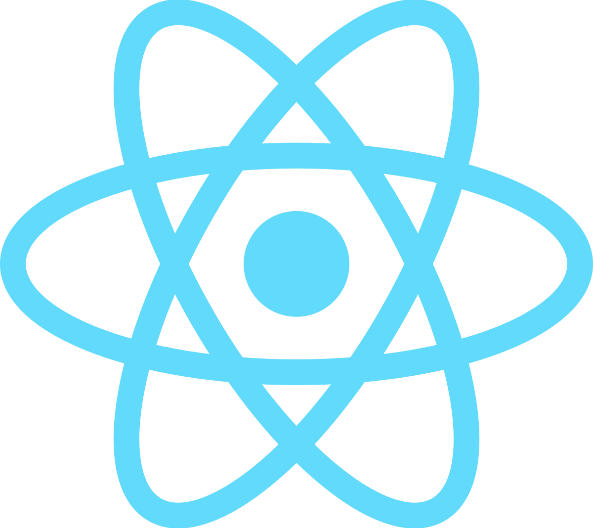
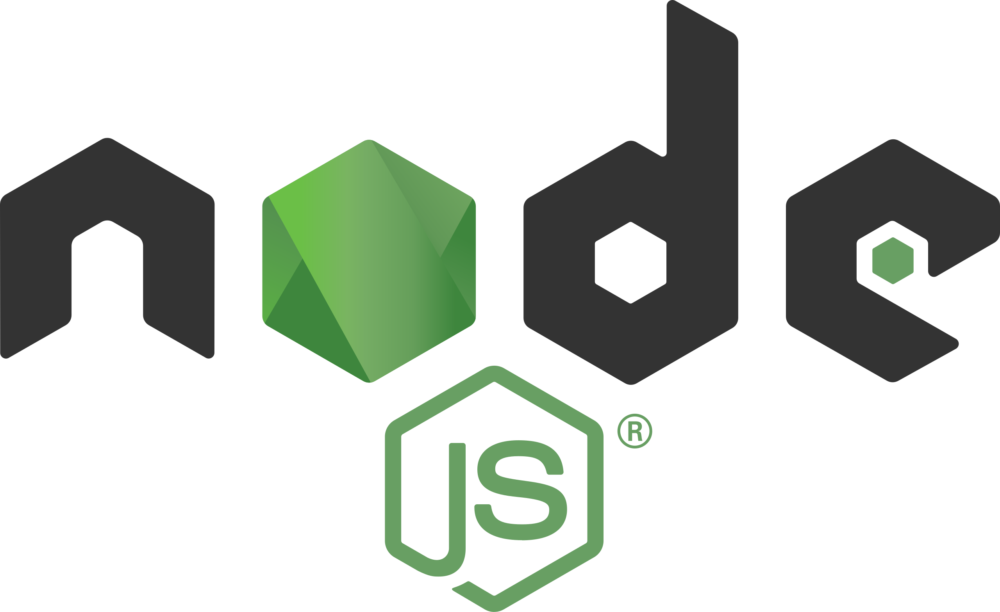
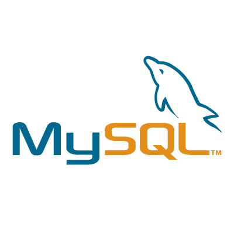

<!-- .slide: data-background-image="./assets/coding-background.jpg" data-background-opacity="0.1" -->

# Web Development in Practice

Theory vs. Reality

---

## Agenda

  

    

      <h3>Tech Stack</h3>
    

  

  

    

      <h3>Decision Matrix</h3>
    

  

  

    

      <h3>Tech Radar</h3>
    

  

  

    

      <h3>Developer Roadmaps</h3>
    

  

---

<!-- .slide: data-background-image="./assets/tech-stack-bg.jpg" data-background-opacity="0.1" -->

# Tech Stack

--

## What is a Tech Stack?

List of all technologies for development and operations

<!-- .element: class="fragment" -->

  Data / Persistence
  Backend
  Frontend
  Runtime Environment

<!-- .element: class="fragment chip-grid" -->

  
  
  
  
  

<!-- .element: class="fragment image-grid" -->

--

## Reality Check

Versatile tech stack in a startup

- Learning on the job (continuously)
- Working agile
- Migration from programmer to product developer

The modern tech stack is no longer a static concept. Developers must continuously learn and adapt.

<!-- .element: class="fragment note" -->

--

## Tech Stack Dimensions

Tech stack encompasses more than just the direct technologies

- IT Infrastructure
- Collaboration Framework
- CI/CD Pipeline
- Documentation
- Monitoring & Observability

<!-- .element: class="fragment" -->

--

## Example Stack

**Database:** MongoDB

**Backend:** Express

**Frontend:** React

**Runtime:** Node

Also called MERN Stack

<!-- .element: class="fragment note" -->

--

## The Central Questions

How do I arrive at a tech stack?

<!-- .element: class="fragment" -->

How do I manage a tech stack in an organization?

<!-- .element: class="fragment" -->

---

<!-- .slide: data-background-image="./assets/decision-matrix-bg.jpg" data-background-opacity="0.1" -->

# Decision Matrix

Systematic Decision Making

--

## Why a Decision Matrix?

Important technical decisions should:

- Be made **explicitly**
- Follow **systematic** processes
- Be **transparently** documented

<!-- .element: class="fragment" -->

--

## The 7-Step Process

1. Understand the situation
2. Define target state
3. Analyze context
4. Define criteria
5. Find alternatives
6. Evaluate alternatives
7. Mitigate risks

--

## 1. Understand the Situation

**Goal:** Shared problem understanding

- Describe problem very specifically
- Why is a decision necessary?
- What happens with **no decision**?

<!-- .element: class="fragment" -->

Note: This step prevents teams from unknowingly solving different problems.

--

## 2. Define Target State

**Technique:** From → To formulation

**Example:**

From: No clear tech strategy, blocking progress

To: Defined tech stack with plan for further decisions

<!-- .element: class="fragment" -->

--

## 3. Analyze Context

Understand all **constraints** and influencing factors:

- Technological limitations
- Organizational framework conditions
- Legal/regulatory requirements
- Time constraints
- Market and competition
- Stakeholders

<!-- .element: class="fragment" -->

Note: Context defines what is possible, not what is desirable.

--

## 4. Define Criteria

**Good criteria are:**

- Measurable (ideally objective)
- Comprehensive
- Relevant
- Clear
- Specific

<!-- .element: class="fragment" -->

--

## Criteria Prioritization

**Best Practice:** 8-10 criteria

**Prioritization:**

  Must have
  Should have
  Could have

<!-- .element: class="fragment" -->

❌ Vague criteria: "Technology should be good"

<!-- .element: class="fragment" -->

--

## 5. Find Alternatives

**Rules:**

- Minimum 3, maximum 5 alternatives
- Don't evaluate yet (except feasibility)
- Include external perspectives
- Also non-obvious options

<!-- .element: class="fragment" -->

Note: Alternatives can combine multiple dimensions: Language + Framework + Hosting.

--

## 6. Evaluate Alternatives

**Two-step evaluation:**

1. **Gather facts** (objective description)
2. **Interpretation** in given context

<!-- .element: class="fragment" -->

--

## Rating System

**Traffic Light Model:**

🟢 Green = fully meets criterion

🟡 Yellow = partially meets criterion

🔴 Red = mostly does not meet criterion

**Optional:** Scoring with weighting

<!-- .element: class="fragment" -->

--

## Example: Evaluating Alternatives

<table class="decision-matrix">
  <thead>
    <tr>
      <th>Criterion</th>
      <th>Priority</th>
      <th>NestJS + VueJS + AWS</th>
      <th>Spring Boot + JSP + Azure</th>
    </tr>
  </thead>
  <tbody>
    <tr>
      <td>The implementing team has sufficient experience with the technology</td>
      <td>Should Have</td>
      <td>The team has brought 4 projects with this tech stack to production in the last 3 years</td>
      <td>Only 2 out of 5 developers have experience with Spring Boot. Azure is known to everyone.</td>
    </tr>
    <tr>
      <td>The project requirements can be implemented</td>
      <td>Must Have</td>
      <td>Feasible</td>
      <td>Feasible</td>
    </tr>
    <tr>
      <td>The technology selection must not contradict guidelines</td>
      <td>Must Have</td>
      <td>Non-Java technologies must be approved as justified exception by an architecture board</td>
      <td>Does not contradict any guidelines.</td>
    </tr>
  </tbody>
</table>

--

## 7. Mitigate Risks

Every decision has side effects

**Typical questions:**

- What new risks emerge?
- What becomes more difficult or impossible?
- How can risks be reduced?

<!-- .element: class="fragment" -->

--

## Template

Template with explanation, example and template
https://miro.com/app/board/uXjVLe4L0co=/

--

## When to Use?

- High-impact decisions
- Unclear or controversial decisions
- Situations with strong bias
- Decisions requiring communication

--

## Advantages of Decision Matrix

- Reduces cognitive and personal bias
- Improves decision quality on average
- Creates transparency and traceability
- Promotes team participation
- Produces lasting documentation

---

<!-- .slide: data-background-image="./assets/tech-radar-bg.jpg" data-background-opacity="0.1" -->

# Tech Radar

Technology Landscape of the Organization

--

## What is a Tech Radar?

Visualizes and controls the **technology landscape**

- Documentation tool
- Strategic control instrument
- Living artifact

<!-- .element: class="fragment" -->

--

## Technology Status

**Adopt** – Production-proven, fully recommended

**Trial** – Successful in use cases, slightly higher risk

**Assess** – Promising, not yet validated

**Hold** – Not recommended for new projects

<!-- .element: class="fragment" -->

--

## Structure

**Segments:**

- Frameworks
- Languages
- DevOps
- SaaS

**Essential:** Search and filter functions

<!-- .element: class="fragment" -->

--

## Organizational Value

A Tech Radar:

- Creates clarity and alignment
- Helps developers with orientation
- Supports recruiting and onboarding
- Guides sales in customer acquisition
- Serves as strategic target state
- Enables planned migrations

<!-- .element: class="fragment" -->

---

<!-- .slide: data-background-image="./assets/roadmap-bg.png" data-background-opacity="0.1" -->

# Developer Roadmaps

Consciously Shaping Your Career

--

## Core Message

Career growth and skill development are **plannable**

A roadmap is a **strategy**, not a checklist

<!-- .element: class="fragment" -->

--

## Important Insights

- There is more than web development
- Consciously choose areas to explore or ignore
- Lifelong learning is an attitude, not a phase
- Awareness of disruption is critical

<!-- .element: class="fragment" -->

--

## Learning Strategy

**Developers should:**

- Define long-term goal
- Plan skill development accordingly
- Regularly review direction
- Have fun with it

<!-- .element: class="fragment" -->

--

## Useful Resources

- Udemy: https://udemy.com
- Coursera: https://coursera.org
- Awesome Github Lists https://github.com/topics/awesome
- roadmap.sh: https://roadmap.sh
- TLDR Newsletter: https://tldr.tech
